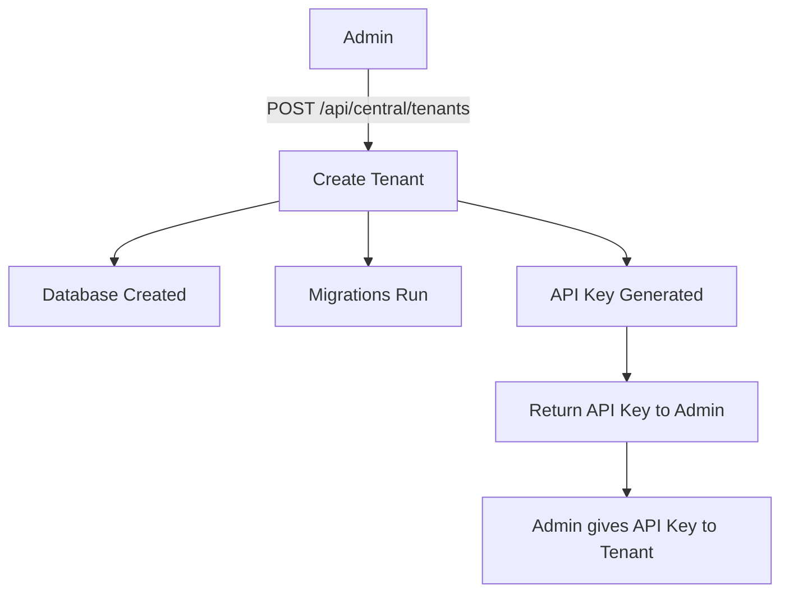
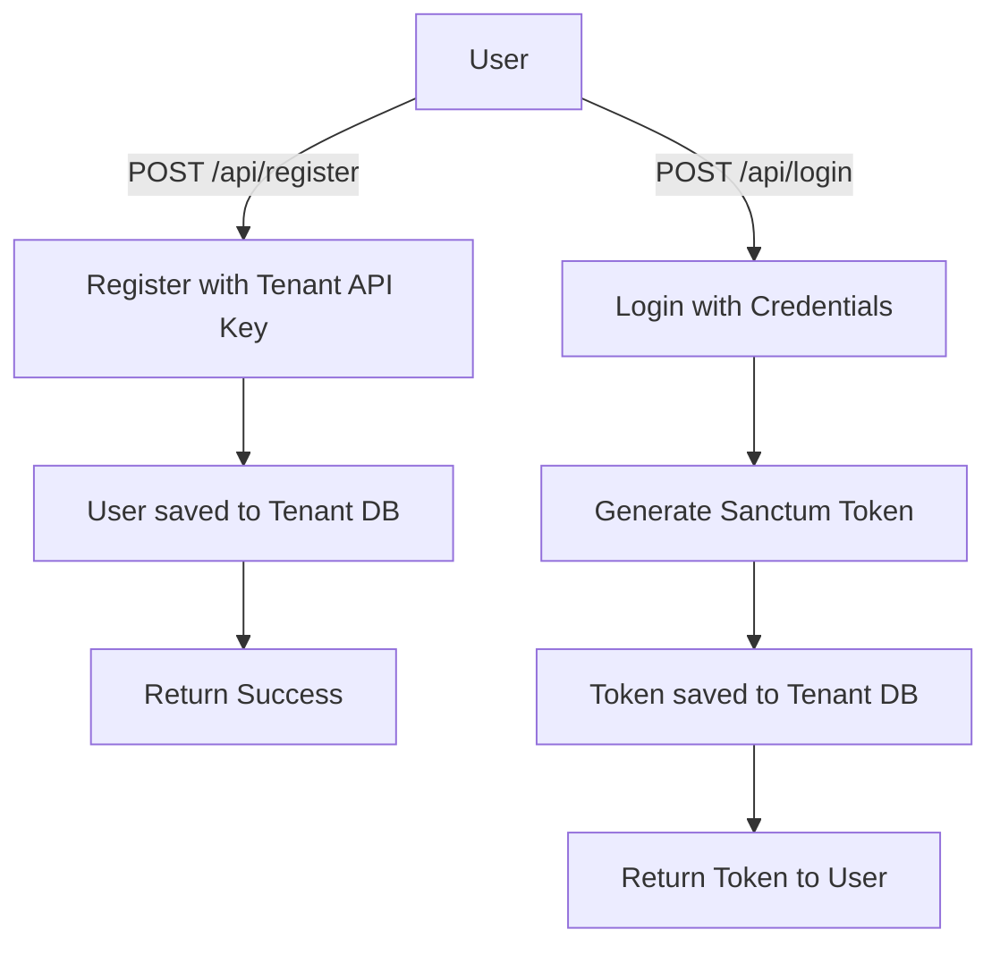
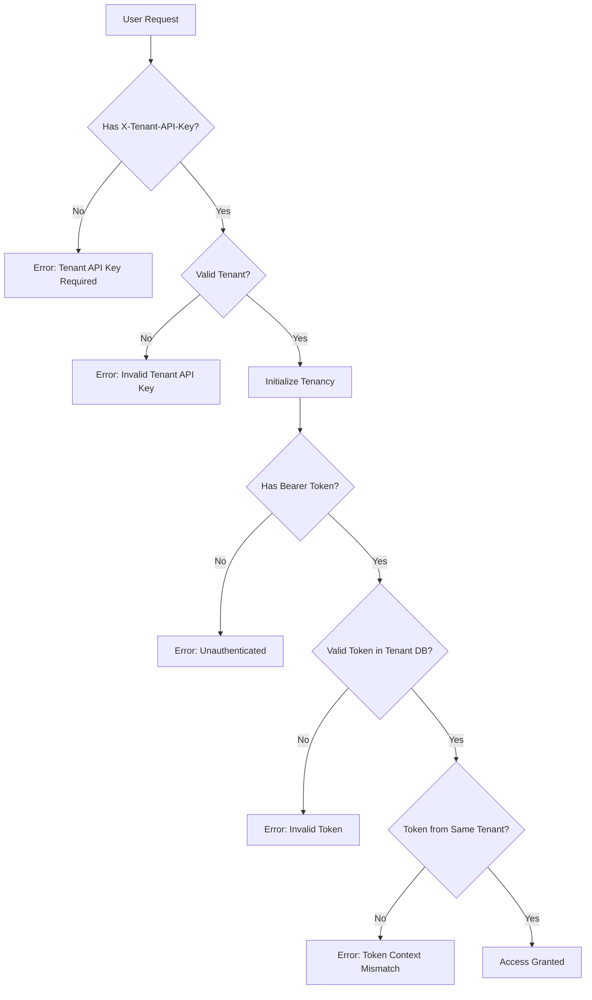

# 🏢 Laravel Multi-Tenant Application

Multi-tenant Laravel application dengan API key-based tenant identification. Setiap tenant memiliki database terpisah untuk isolasi data yang sempurna.


## 📋 Daftar Isi

-   [Fitur](#-fitur)
-   [Arsitektur](#-arsitektur)
-   [Instalasi](#-instalasi)
-   [Konfigurasi](#-konfigurasi)
-   [Dokumentasi API](#-dokumentasi-api)
-   [Alur Kerja](#-alur-kerja)
-   [Keamanan](#-keamanan)
-   [Backup & Restore](#-backup--restore)

## ✨ Fitur

### 🏗️ Multi-Tenancy

-   ✅ **Database Isolation** - Setiap tenant memiliki database terpisah
-   ✅ **API Key Authentication** - Identifikasi tenant via `X-Tenant-API-Key` header
-   ✅ **Dynamic Database Configuration** - Konfigurasi database per-tenant (host, port, username, password)
-   ✅ **Encrypted Credentials** - Password database dienkripsi menggunakan Laravel encryption

### 🔐 Authentication & Authorization

-   ✅ **Laravel Sanctum** - Token-based authentication untuk API
-   ✅ **Role-Based Access Control** - Support role admin/user
-   ✅ **Tenant Token Validation** - Mencegah cross-tenant token usage
-   ✅ **Custom Error Messages** - Pesan error yang informatif

### 💾 Backup & Restore

-   ✅ **Automated Backup** - Scheduled daily & weekly backup
-   ✅ **Manual Backup** - Via Artisan command atau REST API
-   ✅ **Compression Support** - Gzip compression untuk menghemat storage
-   ✅ **Auto Cleanup** - Hapus backup lama otomatis
-   ✅ **Restore Capability** - Restore database dari backup

### 🛠️ Management

-   ✅ **Tenant Management API** - CRUD tenant via REST API
-   ✅ **Health Check** - Monitor koneksi database tenant
-   ✅ **Backup Statistics** - Monitor status backup semua tenant

## 🏛️ Arsitektur

### Database Structure

```
┌─────────────────────┐
│   Central Database  │
│                     │
│  - tenants          │
│  - domains          │
├─────────────────────┤
│                     │
│  Tenant Metadata &  │
│  API Keys Storage   │
└─────────────────────┘
          │
          │ Manages
          ▼
┌──────────────────────────────────────┐
│         Tenant Databases             │
├─────────────┬─────────────┬──────────┤
│  Tenant A   │  Tenant B   │ Tenant C │
│             │             │          │
│ - users     │ - users     │ - users  │
│ - products  │ - products  │ - products│
│ - orders    │ - orders    │ - orders │
│ - tokens    │ - tokens    │ - tokens │
└─────────────┴─────────────┴──────────┘
```

### Request Flow

```
┌──────────────┐
│    Client    │
└──────┬───────┘
       │ X-Tenant-API-Key: tk_abc123...
       │ Authorization: Bearer token...
       ▼
┌──────────────────────────────────────┐
│   Middleware: InitializeTenancyByApiKey│
│   1. Validasi API Key                 │
│   2. Find Tenant                      │
│   3. Initialize Tenancy               │
│   4. Set Database Connection          │
└──────┬───────────────────────────────┘
       │
       ▼
┌──────────────────────────────────────┐
│   Middleware: auth:sanctum            │
│   1. Verify Bearer Token              │
│   2. Load User dari Tenant Database   │
└──────┬───────────────────────────────┘
       │
       ▼
┌──────────────────────────────────────┐
│   Middleware: ValidateTenantToken     │
│   1. Pastikan token dari tenant yang  │
│      sama dengan API key              │
└──────┬───────────────────────────────┘
       │
       ▼
┌──────────────────────────────────────┐
│         Controller Action             │
│   Data dari Tenant Database           │
└───────────────────────────────────────┘
```

## 🚀 Instalasi

### Prerequisites

-   PHP 8.4+
-   Composer
-   MySQL 8.0+
-   Laravel Herd (atau PHP development server lainnya)

### Setup

1. **Clone Repository**

    ```bash
    git clone https://github.com/JunedSetiawan/laravel-multi-tenant-try.git
    cd laravel-multi-tenant-try
    ```

2. **Install Dependencies**

    ```bash
    composer install
    ```

3. **Environment Configuration**

    ```bash
    cp .env.example .env
    php artisan key:generate
    ```

4. **Database Configuration** (`.env`)

    ```env
    # Central Database
    DB_CONNECTION=mysql
    DB_HOST=127.0.0.1
    DB_PORT=3306
    DB_DATABASE=central_db
    DB_USERNAME=root
    DB_PASSWORD=root

    # Tenant Database Template
    TENANT_DB_HOST=127.0.0.1
    TENANT_DB_PORT=3306
    TENANT_DB_USERNAME=root
    TENANT_DB_PASSWORD=root

    # Master API Key untuk Management
    MASTER_API_KEY=your-super-secret-master-key

    # Backup Email Alert (optional)
    BACKUP_ALERT_EMAIL=admin@example.com
    ```

5. **Run Migrations**

    ```bash
    # Migrate central database
    php artisan migrate

    # Seed super admin (optional)
    php artisan db:seed --class=SuperAdminSeeder
    ```

6. **Start Development Server**

    ```bash
    # Jika menggunakan Laravel Herd
    herd link

    # Atau gunakan artisan serve
    php artisan serve
    ```

## ⚙️ Konfigurasi

### Create Tenant

**Endpoint:** `POST /api/central/tenants`

**Headers:**

```
X-Master-API-Key: your-master-key
Accept: application/json
```

**Body:**

```json
{
    "name": "Warung Makan Bu Joko",
    "db_name": "kasir_waroenk",
    "db_host": "localhost",
    "db_port": 3306,
    "db_username": "root",
    "db_password": "root"
}
```

**Response:**

```json
{
    "message": "Tenant created successfully",
    "data": {
        "tenant_id": "warung-makan-bu-joko-abc123",
        "name": "Warung Makan Bu Joko",
        "api_key": "tk_0123456789abcdef...",
        "database": "kasir_waroenk"
    },
    "warning": "Save the API Key securely! It cannot be retrieved again."
}
```

⚠️ **PENTING:** Simpan `api_key` dengan aman! API key ini digunakan untuk akses tenant.

## 📚 Dokumentasi API

### Central Routes (Management)

**Base URL:** `http://localhost/api/central`

**Required Header:** `X-Master-API-Key: your-master-key`

| Method | Endpoint                       | Deskripsi          |
| ------ | ------------------------------ | ------------------ |
| POST   | `/tenants`                     | Create tenant baru |
| GET    | `/tenants`                     | List semua tenant  |
| GET    | `/tenants/{id}`                | Detail tenant      |
| PUT    | `/tenants/{id}`                | Update tenant      |
| DELETE | `/tenants/{id}`                | Delete tenant      |
| POST   | `/tenants/{id}/regenerate-key` | Regenerate API key |
| GET    | `/tenants/{id}/health`         | Health check       |
| POST   | `/tenants/{id}/backup`         | Backup database    |
| GET    | `/tenants/{id}/backups`        | List backups       |
| POST   | `/tenants/{id}/restore`        | Restore database   |

### Tenant Routes (User API)

**Base URL:** `http://localhost/api`

**Required Headers:**

```
X-Tenant-API-Key: tk_your_tenant_key
Accept: application/json
```

#### Public Routes (No Auth Required)

| Method | Endpoint    | Deskripsi            |
| ------ | ----------- | -------------------- |
| POST   | `/register` | Register user baru   |
| POST   | `/login`    | Login user           |
| GET    | `/info`     | Info tenant saat ini |

**Register Example:**

```bash
POST /api/register
Headers:
  X-Tenant-API-Key: tk_abc123...
  Accept: application/json

Body:
{
  "name": "John Doe",
  "email": "john@example.com",
  "username": "johndoe",
  "password": "password123",
  "password_confirmation": "password123",
  "role": "user"
}
```

**Login Example:**

```bash
POST /api/login
Headers:
  X-Tenant-API-Key: tk_abc123...
  Accept: application/json

Body:
{
  "email": "john@example.com",
  "password": "password123"
}

Response:
{
  "message": "Login successful",
  "user": { ... },
  "token": "11|abc123xyz..."
}
```

#### Protected Routes (Auth Required)

**Additional Header:** `Authorization: Bearer {token}`

| Method | Endpoint         | Deskripsi               |
| ------ | ---------------- | ----------------------- |
| GET    | `/me`            | Get user profile        |
| POST   | `/logout`        | Logout user             |
| GET    | `/products`      | List products           |
| POST   | `/products`      | Create product          |
| GET    | `/products/{id}` | Show product            |
| PUT    | `/products/{id}` | Update product          |
| DELETE | `/products/{id}` | Delete product          |
| GET    | `/users`         | List users (admin only) |

**Example Request:**

```bash
GET /api/me
Headers:
  X-Tenant-API-Key: tk_abc123...
  Authorization: Bearer 11|abc123xyz...
  Accept: application/json
```

## 🔄 Alur Kerja

### 1. Setup Tenant Baru



### 2. User Registration & Login



### 3. Access Protected Resources



## 🔐 Keamanan

### 1. Multi-Layer Authentication

-   **Layer 1: Tenant API Key** - Identifikasi tenant
-   **Layer 2: Bearer Token** - Autentikasi user
-   **Layer 3: Token Validation** - Validasi token belongs to tenant
-   **Layer 4: Role-Based Access** - Authorization based on role

### 2. Data Isolation

-   Setiap tenant memiliki database terpisah
-   Tidak ada data sharing antar tenant
-   Token dari Tenant A tidak bisa akses Tenant B

### 3. Encrypted Credentials

-   Password database tenant dienkripsi dengan Laravel encryption
-   API key di-hash dengan SHA-256
-   User password di-hash dengan bcrypt

### 4. Error Messages

Sistem memberikan pesan error yang jelas:

```json
{
    "error": "Invalid Tenant API Key",
    "message": "The provided API key does not match any tenant...",
    "hint": "Make sure you are using the correct API key...",
    "provided_key": "tk_abc123..."
}
```

## 💾 Backup & Restore

### Manual Backup

```bash
# Backup semua tenant
php artisan tenant:backup --compress

# Backup tenant tertentu
php artisan tenant:backup tenant-id-123 --compress

# Custom retention
php artisan tenant:backup --keep-days=60
```

### Automated Backup

Backup otomatis sudah dikonfigurasi di `app/Console/Kernel.php`:

-   **Daily Backup:** Setiap hari jam 02:00 WIB (retention 30 hari)
-   **Weekly Backup:** Setiap Minggu jam 03:00 WIB (retention 90 hari)

### Setup Scheduler (Production)

Tambahkan cron job:

```bash
* * * * * cd /path-to-project && php artisan schedule:run >> /dev/null 2>&1
```

### List Backups

```bash
# List semua backups
php artisan tenant:backups

# List backup tenant tertentu
php artisan tenant:backups tenant-id-123
```

### Restore Database

```bash
# Restore dari backup terbaru
php artisan tenant:restore tenant-id-123

# Restore dari file tertentu
php artisan tenant:restore tenant-id-123 backups/tenant-id/2025/10/backup.sql.gz
```

### Backup via API

```bash
# Create backup
POST /api/central/tenants/{id}/backup
Headers: X-Master-API-Key: your-key
Body: { "compress": true }

# List backups
GET /api/central/tenants/{id}/backups

# Download backup
GET /api/central/tenants/{id}/backups/download?file=backup.sql.gz

# Restore
POST /api/central/tenants/{id}/restore
Body: { "file": "backup.sql.gz" }
```

## 🧪 Testing

### Test Central API

```bash
# Create tenant
curl -X POST http://localhost/api/central/tenants \
  -H "X-Master-API-Key: your-master-key" \
  -H "Accept: application/json" \
  -d '{"name":"Test Tenant","db_name":"test_db"}'
```

### Test Tenant API

```bash
# Register
curl -X POST http://localhost/api/register \
  -H "X-Tenant-API-Key: tk_abc123..." \
  -H "Accept: application/json" \
  -d '{"name":"John","email":"john@test.com","password":"secret"}'

# Login
curl -X POST http://localhost/api/login \
  -H "X-Tenant-API-Key: tk_abc123..." \
  -H "Accept: application/json" \
  -d '{"email":"john@test.com","password":"secret"}'

# Access protected route
curl -X GET http://localhost/api/me \
  -H "X-Tenant-API-Key: tk_abc123..." \
  -H "Authorization: Bearer 11|token..." \
  -H "Accept: application/json"
```

## 📝 Best Practices

### 1. Tenant Management

-   Simpan tenant API key dengan aman
-   Jangan share API key antar tenant
-   Regenerate API key jika terjadi kebocoran

### 2. Database

-   Gunakan database terpisah untuk setiap tenant
-   Backup rutin (automated + manual)
-   Monitor disk space untuk backup

### 3. Security

-   Gunakan HTTPS di production
-   Rate limiting untuk prevent abuse
-   Monitor suspicious activities
-   Update dependencies secara berkala

### 4. Monitoring

-   Health check rutin untuk semua tenant
-   Monitor backup status
-   Log analysis untuk debug

## 🤝 Contributing

Contributions are welcome! Please feel free to submit a Pull Request.

## 📄 License

This project is open-sourced software licensed under the [MIT license](https://opensource.org/licenses/MIT).

## 👨‍💻 Author

**Juned Setiawan**

-   GitHub: [@JunedSetiawan](https://github.com/JunedSetiawan)

## 📞 Support

Jika ada pertanyaan atau issue, silakan buat [GitHub Issue](https://github.com/JunedSetiawan/laravel-multi-tenant-try/issues).

---

**Built with ❤️ using Laravel & Stancl Tenancy**
